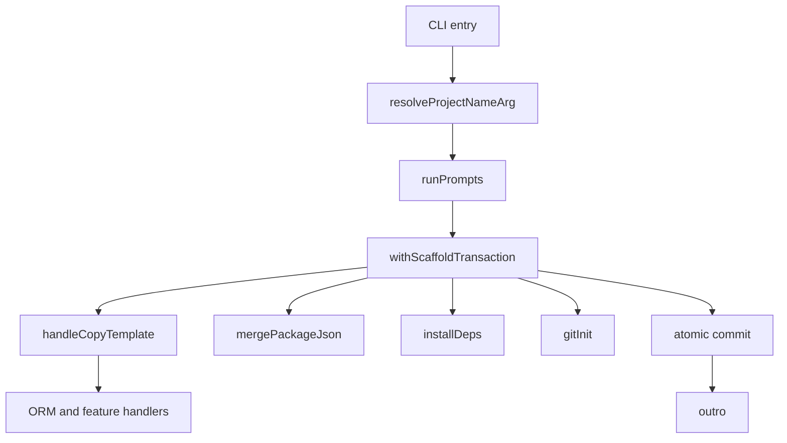

# Architecture

## Top-Level Structure

```text
src/
  bin/create.ts                 CLI orchestration and process entrypoint
  prompt.ts                     Interactive prompt collection
  types.ts                      Shared configuration and package contracts
  helpers/
    scaffoldTransaction.ts      Staging, atomic commit, and rollback
    atomicWriteFile.ts          Same-directory atomic file replacement
    installDeps.ts              Package-manager installation boundary
    gitInit.ts                  Best-effort Git initialization
    resolveProjectName.ts       Argument resolution and current-dir validation
    formatOutro.ts              Completion instructions
    copy-template/              Template copying and generated-file orchestration
    packages/                   Package-manager and package.json logic
    eslint/                     ESLint snippet/config generation
  utils/
    common_content.ts           Dynamic source/config content generators
    prisma/                     Prisma configuration and content
    drizzle/                    Drizzle configuration and content
    mongo/                      Mongoose configuration and content
    redis/                      Redis configuration and content
    websocket/                  WebSocket configuration and content

templates/
  template_ts/                  TypeScript base template
  template_js/                  JavaScript base template
  orm/                          ORM base and database templates
  redis/                        Redis files and package snippet
  socket/                       WebSocket files and package snippet
  eslint/                       ESLint package snippet
  vitest/                       Vitest package snippet

tests/
  unit/                         Vitest unit tests
  e2e/                          Expect PTY driver and matrix runner
```

## Runtime Flow

`src/bin/create.ts` owns orchestration but delegates decisions and side effects:



The transaction callback receives a staging directory, not necessarily the final target path. Every downstream filesystem operation in the callback must therefore use the path it receives.

## Core Contracts

### `ProjectConfig`

`ProjectConfig` is the central configuration object:

```ts
interface ProjectConfig {
  projectName: string;
  language: "ts" | "js";
  orm: "prisma" | "drizzle" | "mongoose" | "none";
  database: "postgresql" | "mysql" | "sqlite" | "mongodb" | "none";
  useRedis: boolean;
  useEslint: boolean;
  useVitest: boolean;
  useSocket: boolean;
}
```

Adding a field requires updates to prompt collection, type definitions, template orchestration, generated output, unit tests, and E2E expectations.

### Template Copying

`handleCopyTemplate` first writes common dynamic files, then builds an ordered list of template-copy jobs. Jobs are awaited sequentially so multiple template layers cannot race while writing overlapping paths. ORM handlers run after all selected template pieces have been copied.

`handleCopyIfExists` verifies a source template path, copies it into the target, excludes the generic `package.snippet.json` file from ordinary copying, and copies that snippet under a label-specific name.

### Package Assembly

`findSnippetFiles` recursively finds `package.snippet*.json` files while skipping `node_modules` and `.git`. `mergePackageJson` sorts snippet paths, deep-merges scripts and dependency maps, normalizes the project name, adjusts script extensions, atomically writes the final package, and only then removes snippets.

### Atomic File Writes

`atomicWriteFile` writes a random temporary file beside the destination and renames it into place. Temporary files are removed after write or rename failure. Same-directory placement is important because rename atomicity is filesystem-dependent across devices.

### Scaffold Transactions

`withScaffoldTransaction`:

- Rejects symbolic-link targets and non-directory targets.
- Copies an existing directory into a staging sibling.
- Creates a new staging directory when the target does not exist.
- Moves the old target to a backup sibling before commit.
- Renames the stage into the target path.
- Removes the backup after success.
- Removes partial output and restores the backup after failure.

The transaction is intended for project initialization, not for arbitrary long-running application operations.

## Error Boundaries

- Invalid project names are handled as a user-facing cancellation with exit code `1`.
- Initialization failures stop the spinner, show a cancellation message, and exit with code `1`.
- The top-level `runCli` wrapper catches unhandled runner failures and sets `process.exitCode`.
- Git failures are deliberately non-fatal and produce a warning.
- Dependency installation failures are fatal to initialization and advise a manual retry command.
